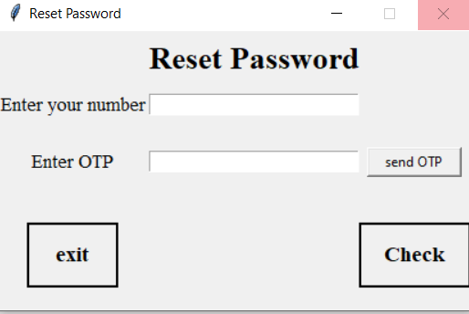

## Simle Login and Register in database with python GUI

python login system and register user with GUI (tkinter) and database (mysql) and finally send OTP code on your phone number

## Screenshots

| Log In | Create an account | OTP send |
| -------|--------------|-----------------|
|  |  |  |

| Password reset | Set new password | Password change |
| ---------------|------------------|-----------------|
|  |  |  |

### Required library

```
pip install tkinter
pip install turtle
pip install pymysql
pip install webbrowser
```

## Installing

first of all you need mysql workbeanch and Create database with Tabels your tabels need this Columns 👇 


After do this you need to open main.py and in line eight [db_connection= Database("", "", "", "127.0.0.1")] insert your 👇


## OTP send to phone number 
in default OTP print in Terminal
if you want OTP code send on you phone you need access to send Message if you have access   
enter your url access in send_mass.py line 21 and 28 in url_enter and uncomment the code ❤️ 
